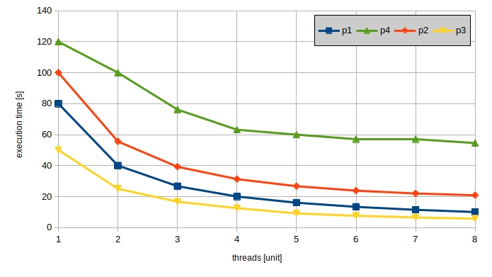
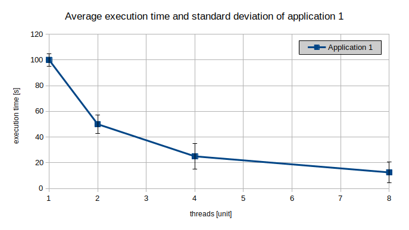

# Submission tutorial

This tutorial is designed to give you the knowledge on how to achieve high-quality submissions in the course PS Parallel Programming.
The focus of this tutorial is on exercises dealing with parallelizing, optimizing and/or measuring the performance of an application, but many concepts can be transferred to theoretical exercises as well.

The tutorial is split into three parts [Measurement](#measurement), [Reporting](#reporting) and [Submission](#submission) providing theoretical background where necessary in addition to practical guidelines and examples.

Remember, this tutorial serves as resource to assist you in creating high-quality submissions. Should you have any questions or require clarification, don't hesitate to discuss them with your instructor.

## Table of contents

- [Measurement](#measurement)
  - [Measurement: Introduction](#measurement-introduction)
  - [Measurement: Guidelines](#measurement-guidelines)
- [Reporting](#reporting)
  - [Reporting: Introduction](#reporting-introduction)
  - [Reporting: Guidelines](#reporting-guidelines)
- [Submission](#submission)
- [Acknowledgements](#acknowledgements)

## Measurement

### Measurement: Introduction

The first step into analyzing an application is to conduct measurements.
In parallel programming we are mostly interested in metrics of performance like

- Execution time
- Hardware counters (L3 cache misses, branch prediction misses, etc.)
- Latency
- Scalability
- ...

In order to measure a metric properly it is important to roughly distinguish between

1. deterministic metrics - e.g. the result is constant no matter how often you measure
2. non-deterministic metrics - e.g. measuring more than once may lead to different results

Depending on the measured metric the methodology has to be adjusted.
For deterministic metrics it is sufficient to measure once, whereas for non-deterministic metrics you have to measure multiple times and use statistical methods for analysis.

### Measurement: Guidelines

Most metrics relevant for parallel programming are non-deterministic metrics like execution time, hardware counters, etc..
Therefore, here are some common guidelines on how to measure non-deterministic metrics:

- Repeat your measurement
  - Rationale: Due to the non-deterministic nature of the metric statistical methods have to be used therefore, multiple data points are required.
  - For this course it is sufficient to repeat measurements at least 3 times, preferably 5 or more times
- Minimize external influences
  - Rationale: External influences can skew your results.
  - For this course this means:
    - Allocate the node exclusively - e.g. use `--exclusive` in `sbatch`
    - Do not run measurements on the login node since you do not have control over the load on the login node
    - Do not cause unnecessary load on the node - e.g. do not start unnecessary background processes

For example a `SLURM` job script measuring the `sleep` application and adhering to the guidelines could look like this:

```sh
#!/bin/bash

#SBATCH --partition=lva
#SBATCH --job-name benchmark_echo
#SBATCH --output=output.log
#SBATCH --ntasks=1
#SBATCH --ntasks-per-node=1

# Guideline: minimize external influences
#SBATCH --exclusive

# Guideline: repeat measurements
for i in {1..10}
do
  /usr/bin/time -f '%e' sleep 5
done
```

## Reporting

### Reporting: Introduction

Once the desired metrics have been measured the next step is to process and analyze the data in order to draw conclusions from it.
In general the way of reporting a metric is dependent on what you want to show with the metric.

This section primarily focuses on reporting non-deterministic metrics, with execution time being a primary example.
As mentioned in the [Measurement](#measurement) section a non-deterministic metric requires statistical methods for analysis.
For this course it is sufficient if you reduce your multiple data points into

1. A representative value - e.g. average, median, etc.
2. A metric of variation - e.g. standard deviation, interquartile range, etc.

### Reporting: Guidelines

Here are some guidelines for reporting results:

- Describe your measurement methodology/platform
  - Rationale: The reader should be able to reproduce the results based on your report
  - If this guideline is relevant for the task it is sufficient to describe the following points
    - the measurement platform - e.g. LCC3, local PC, etc.
    - the compilation process - e.g. compilation flags like `-O3`
    - the measurement process - e.g. time measurement via `/usr/bin/time`, cache miss measurement via `perf`, etc.
  - Link to relevant material like the `Makefile`, the `SLURM` job script, etc.  
- Visualize the data
  - Rationale: A graphical representation is easier to understand in many cases
- Discuss the results
  - Rationale: Enhance the results by providing an analysis
- Report every relevant result in your submission
  - Rationale: Results not part of your submission are inconvenient for the reader
  - For this course this means that all results should be included in your report if possible - e.g. do not reference external resources for your results like the performance comparison spreadsheet
  - In case you have results that do not fit well into the report, but you still want to include them consider creating an Appendix and putting them there

When plotting data make sure that

- The axes are labelled
  - The axis label includes the unit of measurement or "[unit]" if the dimension is unitless
- The graph is labelled
  - Either add a title to the graph or label it in the report
- The measured data points are clearly marked in the graph
  - Rationale: In case your choice of visualization includes interpolation between data points it is important to know which points have been measured and which have been interpolated
- The starting points of the axes are appropriate
  - Rationale: Inappropriate axis starting points might lead to faulty conclusions based on the graph
  - Example: Consider an execution time plot with the execution time on the Y-axis and the number of threads on the X-axis. The Y-axis should start at 0.
- If multiple traces are present in the graph ensure
  - That they can be distinguished easily
  - That the traces are labelled either in a legend or in the report
  - Example: A line plot for the execution time of 3 programs should clearly mark which line corresponds to which program and assign names to the lines in the legend.

The figure below shows an example of an execution time plot adhering to the guidelines:



Depending on the task you may be asked how stable the measurements are.
In this case you can either include the metric of variation - e.g. standard deviation, interquartile range, etc. - into the plot for the representative values, or you can create a separate plot for the metric of variation.

Example plot with standard deviation:



## Submission

The final part of this tutorial deals with submitting the results.
When handing in your results submit

- A report
- The source code
- The build script(s) - e.g. `Makefile`, `CMakeLists.txt`, etc.
- The job script(s) for LCC3
- Any other relevant script used during benchmarking or analysis
- The unprocessed and processed data - Example: csv files for raw data and an excel file for the processed data
- Any figures (if they are available separate from the report)
- The team composition (if not already mentioned in the report)

Depending on the task some points might not be applicable.

Do not submit

- Binaries
- Unrelated files
  - Example: Configuration files from your IDE like ".vscode/settings.json", etc.

## Acknowledgements

Special thanks to

- The PS Parallel Programming instructors, for their contributions to the tutorial
- ChatGPT, for enhancing the writing quality
